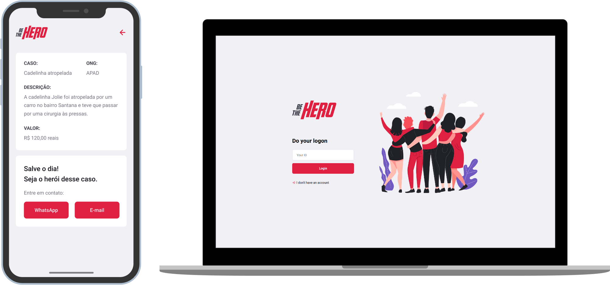

<h1 align="center">
    
</h1>

<h4 align="center">
  🚀 A Web-Mobile application to help NGOs spreading their incidents and getting helpers!
</h4>

  
  
  

  

  

  <a href="#page_with_curl-about">About</a>&nbsp;&nbsp;&nbsp;|&nbsp;&nbsp;&nbsp;
  <a href="#wrench-built-with">Built With</a>&nbsp;&nbsp;&nbsp;|&nbsp;&nbsp;&nbsp;
  <a href="#-how-to-contribute">How to Contribute</a>&nbsp;&nbsp;&nbsp;|&nbsp;&nbsp;&nbsp;
  <a href="#memo-license">License</a>

 

  
    
    
## :computer: Live Preview

You can access this website demo version at the following link [Demo Version](https://bethehero-client.netlify.app)

## :page_with_curl: About

This project is part of a free code week mentored by [Rocketseat](https://rocketseat.com.br/).

This is an application where NGOs could post incidents, to, get help from someone probably interested in their incident. 

The heroes (helpers) could easily contribute since the app has all the information it's needed and the mobile app has a place where the he/she could send a WhatsApp message or Email directly to the selected NGO.

## :wrench: Built With

- [Node.js](https://nodejs.org/en/)
- [React](https://reactjs.org)
- [React Native](https://facebook.github.io/react-native/)
- [Expo](https://expo.io/)

## 🤔 How to Contribute

- Clone the project: `git clonegit@github.com:Silve1ra/be-the-hero.git`;
- Create your branch with your feature: `git checkout -b my-feature`;
- Commit your feature: `git commit -m 'feat: My new feature'`;
- Push to your branch: `git push -u origin my-feature`.

After the merge of your pull request is done, you can delete your branch.

## :memo: License

This project is under the MIT license. See the [LICENSE](LICENSE.md) file for more details.

---

Made with ♥ by <tr>
    <td align="center"><a href="https://github.com/Silve1ra"><b>Felipe Silveira</b></a> </td>
  <tr>
